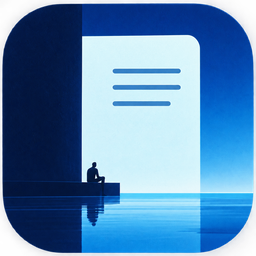

<p align="center">
  
</p>

<h1 align="center">Zima</h1>

<p align="center">A quiet, fast Markdown notes app for Windows.</p>

<p align="center">
  <a href="https://github.com/thefoultarnished/zima/actions/workflows/ci.yml"></a>
  <a href="https://github.com/thefoultarnished/zima/releases"></a>
  
  <a href="https://www.rust-lang.org"></a>
  <a href="https://slint.dev"></a>
  <a href="LICENSE"></a>
  <a href="https://github.com/thefoultarnished/zima/commits/main"></a>
</p>

---

Zima is a place to write things down without the app getting in the way. Notes are plain Markdown files on your own disk, the window opens in a blink, and everything you need is one keystroke away. It's written in Rust with [Slint](https://slint.dev), so it stays light on memory and doesn't ship a web browser inside it.

This is a rewrite of an older Zima built with Tauri and React. It has also been called Note along the way, which is why older data may still live in `%APPDATA%\Note`. Zima copies it over on first start and leaves the old folder alone as a backup.

## What it does

**Writing.** Edit, split or preview mode (`Ctrl+E` cycles between them), a Markdown preview with code highlighting, tables, checklists and a formatting bar if you like buttons. Zen mode hides everything but the text, with typewriter scrolling and a spotlight that fades the lines you're not working on.

**Finding things.** `Ctrl+K` opens a quick switcher that searches notes and runs any command. The sidebar keeps your open notes, pinned notes, favourites, recent notes, notebooks, tags and saved searches in one column, and the Bin sits at the bottom. There's also a daily note (`Ctrl+D`), a random note, "on this day", and a Tasks view that collects every checkbox from every note.

**Commands you type.** Start a line with one of these and press Enter:

| Type | What happens |
|---|---|
| `@remind me to call Sam tomorrow at 5` | Sets a reminder. Repeats work too: `every weekday at 9:30`. |
| `@table 3,4` | Inserts a table with 3 rows and 4 columns. |
| `@calc 12*3.5 + 8` | Replaces the line with the answer. |
| `@goal 500` | Sets a word goal for the note. |
| `@timer 25` | Starts a focus timer. |

If you write something like "dentist friday 10am" without the `@remind`, Zima notices and offers to remind you.

**Getting out of the way.** Close the window and Zima keeps running in the tray, so reminders still go off. If you'd rather the close button quit the app, turn off **Keep running in the tray** in Settings. Opening Zima again while it's already running just brings back the window you have. `Ctrl+Alt+N` opens a small capture box from any app. Any note can pop out as a sticky note that stays on your desktop, and any note with `---` between sections can be presented as slides.

**Making it yours.** Several built-in themes (Light, Dark, Ethereal, Zima Blue, Sakura, Cyberpunk and more), an Auto theme that follows the time of day, your own accent colour, and a fully custom theme in `theme.json`. Text size and the size of the whole interface can be changed separately. Keyboard shortcuts can be rebound in Settings (`Ctrl+,`).

**Also in there.** Spell check, word lookup, writing stats, a calendar, notebooks, note colours, archiving, merging notes, and import and export of Markdown folders and zip files.

## Sync

Notes live in `%APPDATA%\Zima` by default. In Settings you can move them into Google Drive, OneDrive, Dropbox or any other folder, and Zima will pick up changes made on your other computers. If the same note was edited in two places, both versions are kept.

## Backups

Once a day Zima zips your whole notes folder into `%APPDATA%\Zima\backups` and keeps the last 14. Backups always stay on this PC, even when your notes are in a synced folder. **Back up now** in Settings makes one straight away, and **Open backups folder** shows them. To get notes back, unzip a backup into your notes folder while Zima is closed.

## Web clipper

The `clipper/` folder is a small browser extension for Chrome and Edge that sends the page you're reading, or just the text you've selected, into Zima as a new note.

1. Open `chrome://extensions`, turn on Developer mode and choose **Load unpacked**, then pick the `clipper` folder.
2. In Zima, open Settings and copy the web clipper token.
3. Paste it into the extension's popup.

The extension only talks to Zima on your own computer (`127.0.0.1`) and needs that token, so other programs and websites can't add notes.

## Command line

A few things work without opening the window at all:

```sh
zima add "buy milk"
zima add "Groceries\nmilk\neggs"        # the first line becomes the title
zima remind "stretch in 20 min"
zima --help
```

## Building

You'll need a recent [Rust](https://rustup.rs) toolchain on Windows.

```sh
cargo build --release      # target/release/zima.exe (fully optimised, takes several minutes)
cargo test                 # unit tests and command line tests
```

To make an installer, install [Inno Setup 6](https://jrsoftware.org/isinfo.php) (`winget install JRSoftware.InnoSetup`), then after the release build run:

```sh
ISCC installer/zima.iss    # target/installer/Zima-Setup-<version>.exe
```

The installer needs no admin rights. It puts Zima in `%LOCALAPPDATA%\Programs\Zima` and adds it to the Start menu, which also lets reminders show up as coming from Zima rather than Windows PowerShell. Uninstalling leaves your notes alone.

To try it without touching your real notes, point it at an empty folder:

```sh
ZIMA_DATA_DIR=/path/to/scratch ./target/release/zima.exe
```

If your graphics driver gives you trouble, turn on **Low-memory rendering** in Settings, or set `SLINT_BACKEND=winit-software` to draw everything on the CPU.

## Privacy

Zima has no accounts, no telemetry and no analytics. Your notes never leave your computer unless you put them in a synced folder yourself. The only time it goes online is when you look up a word, which asks the free [Dictionary API](https://dictionaryapi.dev) for a definition.

## Fonts

Zima bundles Inter, JetBrains Mono, Literata and Newsreader. All four are under the SIL Open Font License, and their licence files are in `fonts/`.

## License

Zima is under the [MIT License](LICENSE). You can use, change and share it, including in commercial projects, as long as you keep the copyright notice and licence text with it.

The bundled fonts keep their own licence (see Fonts above).
